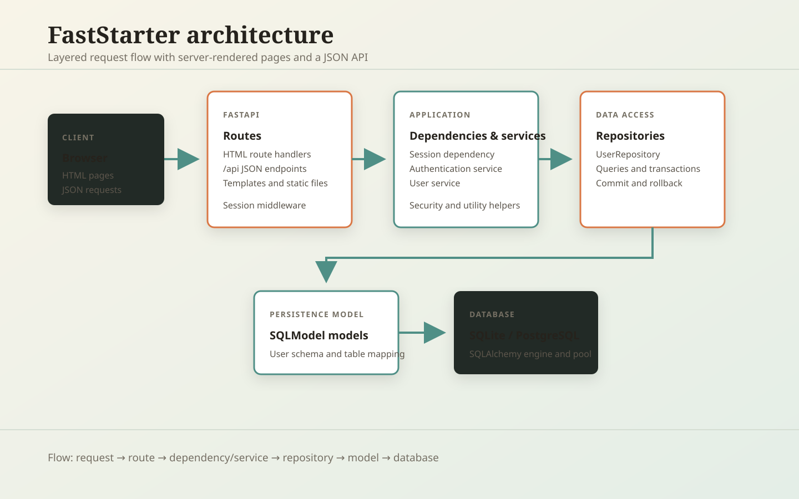
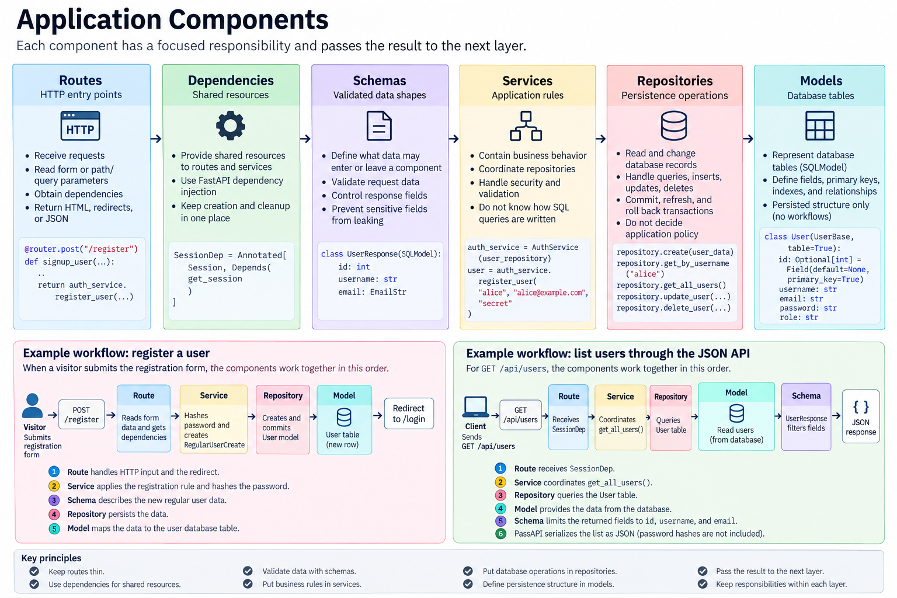

# FastStarter

FastStarter is a small FastAPI web application with server-rendered pages, authentication, SQLModel persistence, and a warm ink, coral, and sea-glass visual theme.

## Features

- Public landing page, registration, login, logout, and health-check routes
- JWT authentication stored in HTTP-only cookies
- SQLite for local development and PostgreSQL for deployment
- Separate regular-user and admin areas
- Responsive HTML templates with shared static CSS and JavaScript
- Unit and integration tests with pytest

## Setup

Requirements: Python 3.10 or newer.

Create a virtual environment and install the pinned dependencies:

```bash
python -m venv .venv
```

Windows PowerShell:

```powershell
.\.venv\Scripts\Activate.ps1
python -m pip install --upgrade pip
pip install -r requirements.txt
```

macOS or Linux:

```bash
source .venv/bin/activate
python -m pip install --upgrade pip
pip install -r requirements.txt
```

All Python dependencies are managed directly in `requirements.txt`.

## Configuration

Copy the example environment file:

```powershell
Copy-Item .env.example .env
```

On macOS or Linux:

```bash
cp .env.example .env
```

The default configuration uses a local SQLite database. Set `SECRET_KEY` before deployment. `CONFIG_PASSWORD` enables the optional configuration page.

## Run locally

Initialize the database and seed demo users:

```bash
python manage.py init
```

Demo accounts:

| Username | Password | Role |
| --- | --- | --- |
| `bob` | `bobpass` | regular_user |
| `admin` | `adminpass` | admin |

Start the development server:

```bash
python manage.py run
```

Open [http://127.0.0.1:5000](http://127.0.0.1:5000) in a browser.

Useful commands:

```bash
python manage.py init --no-drop
python manage.py init --no-seed
python manage.py seed
python manage.py users
python manage.py run --host 127.0.0.1 --port 5000
python manage.py run --no-reload
```

## Tests

Run the unit and integration tests with:

```bash
python -m pytest tests -q
```

The tests cover password hashing, authentication services, JWT claims, and service/repository behavior against an isolated SQLite database.

## Application components

The application is organized into components with focused responsibilities. A component should only handle the work appropriate to its layer and pass the result to the next layer.



This diagram shows how requests move from routes through dependencies, schemas, services, repositories, and models before reaching the database. The source image is available at [`app/static/img/architecture.svg`](app/static/img/architecture.svg).

### Routes

Routes are the HTTP entry points in `app/routers/`. They receive requests, read form or path/query parameters, obtain dependencies, and return HTML responses, redirects, or JSON responses.

Use a route when adding a new URL or changing how HTTP requests and responses are handled. Routes should stay thin: they should coordinate the request rather than contain database queries or substantial business rules.

Example: `app/routers/register.py` exposes:

```python
@router.post("/register")
def signup_user(request: Request, db: SessionDep, username: str = Form(), ...):
		user_repo = UserRepository(db)
		auth_service = AuthService(user_repo)
		return auth_service.register_user(username, email, password)
```

The route receives the form, creates the required dependencies, calls the service, and redirects the user. It does not directly insert a `User` row.

### Dependencies

Dependencies provide shared resources to routes and services. `SessionDep` in `app/dependencies/session.py` supplies a SQLModel database session through FastAPI dependency injection.

Use a dependency when multiple routes need the same request-scoped resource, such as a database session, authenticated user, or permission check.

```python
SessionDep = Annotated[Session, Depends(get_session)]
```

This keeps session creation and cleanup in one place instead of repeating it in every route.

### Schemas

Schemas define validated data shapes at application boundaries. They are in `app/schemas/` and describe what data may enter or leave a component.

Use a schema when validating request data, defining a service input, or controlling the fields returned to a client. Schemas help prevent database-only fields such as password hashes from leaking in responses.

Examples:

- `RegularUserCreate` describes a regular user to be created and supplies the `regular_user` role.
- `AdminCreate` describes an admin user to be created.
- `UserResponse` limits API output to `id`, `username`, and `email`.
- `UserUpdate` describes editable username and email fields.

```python
class UserResponse(SQLModel):
		id: int
		username: str
		email: EmailStr
```

### Services

Services contain application rules and coordinate repositories. They are in `app/services/`.

Use a service when an operation involves business behavior, security, validation, multiple repository calls, or a meaningful workflow. Services should not know how SQL queries are written.

`AuthService` is responsible for registration and login. It hashes passwords during registration, verifies passwords during login, and creates access tokens after successful authentication. `UserService` coordinates user-related operations such as retrieving users.

```python
auth_service = AuthService(user_repository)
user = auth_service.register_user("alice", "alice@example.com", "secret")
token = auth_service.authenticate_user("alice", "secret")
```

### Repositories

Repositories contain persistence operations. They are in `app/repositories/` and receive a database session.

Use a repository when reading or changing database records. A repository should handle queries, inserts, updates, deletes, commits, refreshes, and rollbacks, but should not decide application policy such as how passwords are verified.

`UserRepository` provides operations such as:

```python
repository.create(user_data)
repository.get_by_username("alice")
repository.get_all_users()
repository.update_user(user_id, user_update)
repository.delete_user(user_id)
```

### Models

Models represent database tables and are in `app/models/`. The `User` model is a SQLModel table with `id`, `username`, `email`, `password`, and `role` fields.

Use a model when defining the structure persisted in the database, including primary keys, indexes, uniqueness, and relationships. Models are not the place for login workflows or route formatting.

```python
class User(UserBase, table=True):
		id: Optional[int] = Field(default=None, primary_key=True)
```

### Example workflow: register a user

When a visitor submits the registration form, the components work together in this order:

```text
POST /register
	-> route reads username, email, and password form fields
	-> SessionDep provides a database session
	-> AuthService hashes the password and creates RegularUserCreate
	-> UserRepository creates and commits a User model
	-> database stores the new row
	-> route redirects to /login
```

The important boundaries are:

1. The **route** handles HTTP input and the redirect.
2. The **service** applies the registration rule and hashes the password.
3. The **schema** describes the new regular user data.
4. The **repository** persists the data.
5. The **model** maps the data to the `user` database table.

### Example workflow: list users through the JSON API

For `GET /api/users`, the flow is:

```text
GET /api/users
	-> route receives SessionDep
	-> UserRepository queries the User table
	-> UserService coordinates get_all_users()
	-> UserResponse filters the returned fields
	-> FastAPI serializes the list as JSON
```

This route returns public user fields only. Password hashes remain on the database model and are not included in `UserResponse`.

## Postman collection

Import [`postman/FastStarter.postman_collection.json`](postman/FastStarter.postman_collection.json) into Postman to test the health check and users API. The collection defaults to `http://127.0.0.1:5000`; change its `baseUrl` variable for another environment.

## Deployment

The repository includes `render.yaml` for deploying the web service and PostgreSQL database on Render.

The web service uses:

- Build command: `pip install -r requirements.txt`
- Start command: `python manage.py init --no-drop && python manage.py run --host 0.0.0.0 --port $PORT`
- `DATABASE_URI`: PostgreSQL connection string
- `SECRET_KEY`: production signing key
- `ENV`: `production`

The Docker image also installs dependencies directly from `requirements.txt`.

## Project structure



```text
faststart
|-- README.md
|-- manage.py
|-- requirements.txt
|-- Dockerfile
|-- render.yaml
|-- .env.example
|-- tests/
|   |-- test_unit.py
|   |-- test_integration.py
|-- app/
|   |-- cli.py
|   |-- config.py
|   |-- database.py
|   |-- main.py
|   |-- models/
|   |-- repositories/
|   |-- routers/
|   |-- schemas/
|   |-- services/
|   |-- static/
|   |-- templates/
|   |-- utilities/
```
